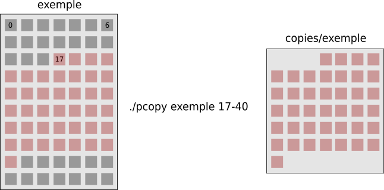

# TP0 - Copie partielle

L'objectif du TP0 est de développer l'utilitaire `pcopy` capable de copier une partie délimitée d'un ou plusieurs fichiers.

## Description de l'outil

```
pcopy [<PATH> <OFFSET>-<BYTES>]...
```

`pcopy` va parcourir les paramètres d'appel et extraire, en couple, les arguments suivants (dans cet ordre),
- `PATH` un chemin identifiant le fichier à copier,
- les valeurs de `OFFSET` et `BYTES` deux entiers positifs ou nuls séparés par un tiret (`-`) qui représentent, respectivement,
  - l'octet à partir duquel la copie commence,
  - le nombre d'octets à copier.

Une fois ces arguments lus, l'utilitaire `pcopy` va procéder ainsi,
- il va créer un répertoire nommé `copies` dans le répertoire courant,
- pour chaque couple `PATH`, `OFFSET-BYTES` lu,
  - il va créer un fichier dans le répertoire `copies`, avec les permissions d'accès `644`, qui porte le même nom que le fichier identifié par le chemin `PATH`,
  - à partir de l'octet `OFFSET` inclusivement, il va copier au plus `BYTES` octets (ou jusqu'à la fin du fichier) du fichier identifié par `PATH`, dans le nouveau fichier du même nom fraichement créé dans `copies`.

Si tout s'est déroulé sans erreur, à la fin des copies, l'utilitaire `pcopy` affiche le nombre total d'octets copiés et se termine en retournant la valeur `0`.

### Traitement des erreurs et valeur de retour

`pcopy` retourne `0` en cas de succès et `1` en cas d'échec. Aucun message d'erreur ne doit être affiché et tous les retours d'appels système doivent être traités correctement. Si un appel système échoue, `pcopy` s'arrête et retourne la valeur `1`. Évidemment, dépendamment de vos choix d'implémentation, certaines erreurs peuvent être acceptables/gérables et, par conséquent, ne vont pas arrêter le programme. **Pensez donc à évaluer la variable `errno`**, s'il y a lieu, avant d'arrêter l'exécution de `pcopy`.

### Exemples d'exécution

<p>

<details>

<summary>Illustration</summary>



</details>

</p>

<p>

<p>

<details>

<summary>Exemple 1</summary>

<pre>
<b>groot@iam:~/$</b> ls
hello   pcopy
<b>groot@iam:~/$</b> cat hello
Bonjour le monde!
<b>groot@iam:~/$</b> wc hello 
 1  3 18 hello
<b>groot@iam:~/$</b> ./pcopy hello 12-6
6
<b>groot@iam:~/$</b> ls
copies  hello  pcopy
<b>groot@iam:~/$</b> ls copies
hello
<b>groot@iam:~/$</b> cat copies/hello 
onde!
<b>groot@iam:~/$</b> wc copies/hello 
1 1 6 copies/hello
</pre>

</details>

</p>

<p>

<details>

<summary>Exemple 2</summary>

<pre>
<b>groot@iam:~/$</b> ls
other  pcopy
<b>groot@iam:~/$</b> ls other/
bonjour.java
<b>groot@iam:~/$</b> cat other/bonjour.java 
class Simple{
    public static void main(String args[]){
    System.out.println("Hello Java");
    }
}
<b>groot@iam:~/$</b> wc other/bonjour.java 
  5  11 104 other/bonjour.java
<b>groot@iam:~/$</b> ./pcopy other/bonjour.java 50-70
54
<b>groot@iam:~/$</b> ls
copies  other  pcopy
<b>groot@iam:~/$</b> ls copies/
bonjour.java
<b>groot@iam:~/$</b> cat copies/bonjour.java 
rgs[]){
    System.out.println("Hello Java");
    }
}
<b>groot@iam:~/$</b> wc copies/bonjour.java 
 4  5 54 copies/bonjour.java
</pre>

</details>

</p>

<p>

<details>

<summary>Exemple 3</summary>

<pre>
<b>groot@iam:~/$</b> ls
hello  other  pcopy
<b>groot@iam:~/$</b> ls other/
bonjour.java
<b>groot@iam:~/$</b> cat hello
Bonjour le monde!
<b>groot@iam:~/$</b> wc hello 
 1  3 18 hello
<b>groot@iam:~/$</b> cat other/bonjour.java 
class Simple{
    public static void main(String args[]){
    System.out.println("Hello Java");
    }
}
<b>groot@iam:~/$</b> wc other/bonjour.java 
  5  11 104 other/bonjour.java
<b>groot@iam:~/$</b> ./pcopy hello 12-6 other/bonjour.java 50-43
49
<b>groot@iam:~/$</b> ls
copies  hello  other  pcopy
<b>groot@iam:~/$</b> ls copies/
bonjour.java  hello
<b>groot@iam:~/$</b> cat copies/hello 
onde!
<b>groot@iam:~/$</b> wc copies/hello 
1 1 6 copies/hello
<b>groot@iam:~/$</b> cat copies/bonjour.java 
rgs[]){
    System.out.println("Hello Java"<b>groot@iam:~/$</b> wc copies/bonjour.java 
 1  3 43 copies/bonjour.java
</pre>

</details>

</p>


## Directives d'implémentation

Vous devez développer le programme en C.
Le fichier source doit s'appeler `pcopy.c` et être à la racine du dépôt.
Vu la taille du projet, tout doit rentrer dans ce seul fichier source.

Pour la réalisation du TP, vous devez respecter les directives suivantes.

### Appels système

- **Vous devez utiliser l'appel système** `open` pour toute ouverture de fichier (que ça soit en lecture ou en écriture).
  - Pensez au **ou binaire** pour combiner vos _flags_.
- Vous utiliserez les appels système `close`, `read`, `write` et `lseek` pour manipuler les fichiers et `mkdir` pour créer le répertoire `copies`.
- Noubliez pas de traiter les erreurs de chaque appel système.

### Précisions

- Vous pouvez supposer que les arguments avec lesquels l'utilitaire `pcopy` sera testé sont valides. C'est à dire,
  - `PATH` est un chemin vers un fichier qui existe et est lisible,
  - `OFFSET` et `BYTES` sont deux entiers positifs ou nuls, séparés par un tiret (`-`).
- Si le répertoire `copies` existe dans le répertoire courant, il sera utilisé directement par `pcopy`.
- Le fichier identifié par le chemin `PATH` doit être ouvert en lecture seule.
- Si un fichier portant le nom du fichier à copié existe déjà dans le répertoire `copies`, il sera ecrasé par `pcopy`. 
- Pour un couple `PATH`, `OFFSET-BYTES`, si la position `OFFSET` dépasse la taille du fichier identifié par `PATH`, `pcopy` s'arrête et retourne la valeur `1`. **Remarque.** Tous les fichiers qui venaient avant doivent être traités et, par conséquent, `pcopy` va retourner la valeur `1` **ET** afficher le nombre d'octets copiés (même si ça vaut `0`).
- Vous pouvez assumer que la taille maximale qui sera copiée à partir d'un fichier ne dépassera pas `4096` octets.
- Comme le TP n'est pas si gros (de l'ordre de grandeur d'une centaines de lignes), il est attendu un effort important sur le soin du code et la gestion des cas d'erreurs.

